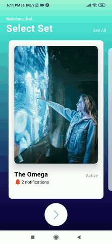

# Reel Ready

Film production is an expensive process that requires effort and dedication from many people. Though seeing a final product on the screen is always an enlightening experience, a lot of planning and communication is involved in the process. As someone who has worked on a number of student film sets, I have had firsthand experiences in production getting delayed because of missing documents such as scripts and shot lists. In addition, miscommunication has always been a factor for when crew or cast members show up behind schedule on set. How can we mitigate these problems with technology?

        

## The Birth of Reel Ready
### June 2019

Collaborating on this project with a friend of mine who initially conceptualized the project and subsequently designed the UI/UX of the application (check out her work at [Natalie Moey](https://www.nataliemoey.com/)), I set out to research the variety of technologies available for developing mobile applications. Having previously worked with React Native, I knew I wanted to stick with it as it allowed me to write code once and use it for both Android and iOS, with minor tweaks in between. The remainder of the technology stack/libraries used is as follows:

1. **React-Redux**: Managing application state in a shared store for easier scalability
2. **React-Navigation**: Handling routing and navigation between the number of different screens in the application
3. **Google-Firebase**: Keeping track of data and managing user authentication

After settling on the technologies that I was going to utilized to start putting the pieces together, I dedicated a large amount of time reinforcing my knowledge of React Native, along with learning the new libraries/frameworks that I was going to be utilizing for the first time. 

## Registration and Login 
### September to December 2019

In line with the beginning of my final semester in school, I got started in designing and fleshing out UI components while keeping modularity in mind and actively considering how I might be able to reduce the amount of repeated code. As I had been more experienced in developing application front-ends, putting together the 'Registration', 'Login', and 'Forgot Password' screens was a relatively straightforward process. However, integrating Redux and Google Firebase to implement the features of the corresponding screens above was a lot more challenging. Through scouring the web in search for more tutorials and learning about how other people have implemented similar features, I was able to, slowly but surely, start connecting the front-end to the back-end of the application.

## Concluding Thoughts (For Now)

Being the sole developer of Reel Ready has been, undoubtedly, a challenging position to be in. However, I am enjoying every bit of seeing parts and pieces of the application come together, and is extremely excited to continually add an increasing number of screens and working features to the application. Most importantly, I am looking forward to learning more and honing my skills as a software developer. In addition, as someone who understands the possibilities and benefits that Reel Ready can bring to the film production process, I am very much personally invested in its long-term development process.

